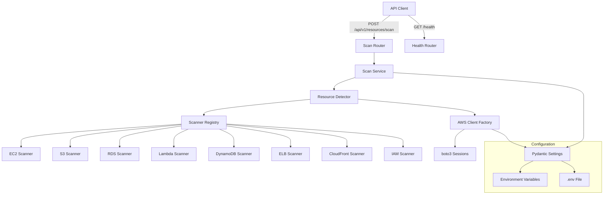

# Design Document: AWS Resource Detection

## Overview

This design describes the architecture and implementation of the AWS Resource Detection backend — a Python FastAPI application that connects to an AWS account and discovers all created resources across multiple services and regions. The application lives in a `backend/` directory and provides a REST API for triggering scans and retrieving resource inventories.

**Key Design Decisions:**

1. **Synchronous boto3 with ThreadPoolExecutor** — Rather than introducing `aioboto3` (which has limited pagination support and stability concerns), we use standard `boto3` wrapped in `asyncio.to_thread` with a bounded `ThreadPoolExecutor`. This gives us concurrency control via `asyncio.Semaphore` while keeping boto3 usage simple and well-documented.

2. **Per-service scanner pattern** — Each AWS service has its own scanner class implementing a common interface. This makes it straightforward to add new services and to isolate failures per-service.

3. **Pydantic for everything** — Configuration (via `pydantic-settings`), request/response models, and internal data transfer objects all use Pydantic for validation and serialization consistency.

4. **Global scan lock** — A simple `asyncio.Lock` prevents concurrent scan executions, meeting the 429 requirement without needing external state.

## Architecture



### Layer Responsibilities

| Layer | Responsibility |
|-------|---------------|
| **Routers** | HTTP request handling, response formatting, error translation |
| **Services** | Orchestration logic, scan lifecycle, concurrency lock |
| **Resource Detector** | Coordinates scanners, applies timeouts, aggregates results |
| **Scanners** | Service-specific AWS API calls, pagination, resource extraction |
| **AWS Client Factory** | Creates authenticated boto3 clients per region/service |
| **Config** | Loads and validates environment-based settings |
| **Models** | Pydantic schemas for API responses and internal DTOs |

## Components and Interfaces

### 1. Configuration (`backend/config/settings.py`)

```python
from pydantic_settings import BaseSettings
from pydantic import field_validator
from typing import List, Literal

class Settings(BaseSettings):
    # AWS credentials
    aws_access_key_id: str
    aws_secret_access_key: str
    aws_default_region: str = "us-east-1"
    aws_session_token: str | None = None
    
    # Scan configuration
    aws_regions: List[str] = ["us-east-1"]
    max_concurrent_api_calls: int = 10
    max_retry_attempts: int = 3
    scan_timeout_seconds: int = 300
    
    # Application
    log_level: Literal["DEBUG", "INFO", "WARNING", "ERROR", "CRITICAL"] = "INFO"
    
    model_config = {"env_file": ".env", "env_file_encoding": "utf-8"}
    
    @field_validator("aws_regions", mode="before")
    @classmethod
    def parse_regions(cls, v):
        if isinstance(v, str):
            return [r.strip() for r in v.split(",")]
        return v
```

### 2. AWS Client Factory (`backend/services/aws_client.py`)

```python
class AWSClientFactory:
    """Creates authenticated boto3 clients with credential validation."""
    
    def __init__(self, settings: Settings): ...
    
    async def validate_credentials(self) -> None:
        """Calls STS get_caller_identity to verify credentials.
        Raises AuthenticationError if credentials are invalid or missing."""
    
    def create_client(self, service_name: str, region: str) -> boto3.client:
        """Creates a boto3 client for the given service and region."""
    
    def get_valid_regions(self) -> List[str]:
        """Returns the configured regions after validation."""
```

### 3. Base Scanner Interface (`backend/services/scanners/base.py`)

```python
from abc import ABC, abstractmethod
from typing import List
from backend.models.resource import DetectedResource

class BaseScanner(ABC):
    """Base class for all AWS service scanners."""
    
    service_name: str
    is_global: bool = False  # Global services scan once regardless of regions
    
    @abstractmethod
    async def scan(self, client: boto3.client, region: str) -> List[DetectedResource]:
        """Scan the given region for resources of this service type.
        Must handle pagination internally."""
        ...
```

### 4. Resource Detector (`backend/services/resource_detector.py`)

```python
class ResourceDetector:
    """Orchestrates scanning across all services and regions."""
    
    def __init__(
        self,
        client_factory: AWSClientFactory,
        scanners: List[BaseScanner],
        settings: Settings,
    ): ...
    
    async def detect_all(self) -> ResourceInventory:
        """Runs all scanners with concurrency limiting and timeout.
        Returns a ResourceInventory with detected resources and failures."""
```

**Concurrency Strategy:**
- Uses `asyncio.Semaphore(max_concurrent_api_calls)` to limit parallel AWS calls
- Each scanner call is wrapped in `asyncio.to_thread()` to run boto3 synchronously in a thread pool
- Global timeout via `asyncio.wait_for()` with 300-second limit
- Individual service failures are caught and recorded; scanning continues

### 5. Scan Service (`backend/services/scan_service.py`)

```python
class ScanService:
    """Manages scan lifecycle and prevents concurrent scans."""
    
    def __init__(self, detector: ResourceDetector): ...
    
    async def run_scan(self) -> ScanResponse:
        """Acquires scan lock, runs detection, returns response.
        Raises ScanInProgressError if a scan is already running."""
```

### 6. Routers (`backend/routers/`)

- **`health.py`** — `GET /health` returning `{"status": "healthy", "service": "ai-cloud-cost-detective"}`
- **`scan.py`** — `POST /api/v1/resources/scan` triggering full resource detection

### 7. Middleware (`backend/middleware/`)

- **Correlation ID middleware** — Generates a UUID per request, attaches to request state, includes in all log output
- **Request logging middleware** — Logs method, path, status code, and response time

## Data Models

### Core Resource Model

```python
from pydantic import BaseModel
from typing import Optional, List, Dict

class DetectedResource(BaseModel):
    resource_id: str
    resource_type: str
    service: str
    region: str
    created_at: Optional[str] = None  # ISO 8601 or null
    state: str

class ScanFailure(BaseModel):
    service: str
    region: str
    error: str

class ScanSummary(BaseModel):
    total_count: int
    count_per_service: Dict[str, int]
    regions_scanned: List[str]
    timed_out: bool = False

class ResourceInventory(BaseModel):
    resources: List[DetectedResource]
    failures: List[ScanFailure]
    summary: ScanSummary
```

### API Response Models

```python
class ScanResponse(BaseModel):
    resources: List[DetectedResource]
    summary: ScanSummary
    failures: List[ScanFailure] = []

class ErrorResponse(BaseModel):
    error: str
    correlation_id: str | None = None

class HealthResponse(BaseModel):
    status: str
    service: str
```

### Configuration Model

```python
class Settings(BaseSettings):
    aws_access_key_id: str
    aws_secret_access_key: str
    aws_default_region: str = "us-east-1"
    aws_session_token: str | None = None
    aws_regions: List[str] = ["us-east-1"]
    max_concurrent_api_calls: int = 10
    max_retry_attempts: int = 3
    scan_timeout_seconds: int = 300
    log_level: Literal["DEBUG", "INFO", "WARNING", "ERROR", "CRITICAL"] = "INFO"
```

### Service Scanner Return Mapping

| Service | Resource Types | Key boto3 APIs |
|---------|---------------|----------------|
| EC2 | instances, volumes, snapshots, elastic_ips | `describe_instances`, `describe_volumes`, `describe_snapshots`, `describe_addresses` |
| S3 | buckets | `list_buckets` |
| RDS | instances, clusters | `describe_db_instances`, `describe_db_clusters` |
| Lambda | functions | `list_functions` |
| DynamoDB | tables | `list_tables`, `describe_table` |
| ELB | load_balancers | `describe_load_balancers` (v2) |
| CloudFront | distributions | `list_distributions` |
| IAM | users, roles | `list_users`, `list_roles` |

## Correctness Properties

*A property is a characteristic or behavior that should hold true across all valid executions of a system — essentially, a formal statement about what the system should do. Properties serve as the bridge between human-readable specifications and machine-verifiable correctness guarantees.*

### Property 1: Serialization Round-Trip

*For any* valid `ResourceInventory` object (containing any combination of `DetectedResource` items, `ScanFailure` items, and a `ScanSummary`), serializing to JSON and deserializing back SHALL produce an object with identical field names, types, and values.

**Validates: Requirements 5.6**

### Property 2: Resource Schema Completeness

*For any* `DetectedResource` returned by any scanner, the JSON serialization SHALL include all required fields (`resource_id` as string, `resource_type` as string, `service` as string, `region` as string, `created_at` as string or null, `state` as string) with correct types.

**Validates: Requirements 3.2, 4.3**

### Property 3: ResourceInventory Aggregation Correctness

*For any* set of scan results (where each scanner returns either a list of resources or raises an error), the resulting `ResourceInventory` SHALL have: `summary.total_count` equal to the total number of resources across all successful scans, `summary.count_per_service` correctly tallying resources per service name, `summary.regions_scanned` listing all regions that were scanned, and all failed scanners appearing in the `failures` list while all successful resources appear in the `resources` list.

**Validates: Requirements 3.4, 3.5, 5.4, 8.3**

### Property 4: Null Field Preservation

*For any* `DetectedResource` where `created_at` is `None`, the JSON serialization SHALL include the key `"created_at"` with a value of `null`, rather than omitting the field entirely.

**Validates: Requirements 5.5**

### Property 5: Configuration Validation — Missing Required Values

*For any* non-empty subset of required configuration variables (`aws_access_key_id`, `aws_secret_access_key`) that is missing from the environment, the Settings validation error SHALL identify each missing variable by name.

**Validates: Requirements 2.3, 6.3**

### Property 6: Configuration Validation — Invalid Values

*For any* configuration field given an invalid value (unrecognized region identifier, non-positive integer for rate limiting, or unsupported log level string), the Settings validation error SHALL indicate the variable name and the set of accepted values.

**Validates: Requirements 2.7, 6.5**

### Property 7: Scanner Invocation Pattern

*For any* set of N configured regions (1 ≤ N ≤ 30), regional scanners (EC2, RDS, Lambda, DynamoDB, ELB) SHALL be invoked exactly N times (once per region), and global scanners (S3, CloudFront, IAM) SHALL be invoked exactly once regardless of N.

**Validates: Requirements 2.6, 3.3**

### Property 8: Pagination Completeness

*For any* paginated AWS API response with N pages of results, the scanner SHALL return the combined resources from all N pages, with no pages skipped or duplicated.

**Validates: Requirements 3.6**

### Property 9: Error Response Sanitization

*For any* unhandled exception with any message content (including file paths, class names, or stack traces), the API error response SHALL contain only a general error description and correlation ID, with no stack traces, internal file paths, or internal service class names exposed.

**Validates: Requirements 4.7, 7.5**

### Property 10: Structured Log Field Completeness

*For any* log event produced by the application, the JSON log entry SHALL contain at minimum: `timestamp` (ISO 8601 format), `level`, `correlation_id`, and `message` fields.

**Validates: Requirements 7.1**

### Property 11: Correlation ID Consistency

*For any* single API request, all log entries produced during that request's processing SHALL share the same correlation ID value. *For any* two distinct concurrent requests, their correlation IDs SHALL be different.

**Validates: Requirements 7.4**

### Property 12: Log Level Correctness

*For any* failure or exception event, the log level SHALL be ERROR. *For any* retry event, the log level SHALL be WARNING. *For any* request lifecycle event (received, completed), the log level SHALL be INFO.

**Validates: Requirements 7.6**

### Property 13: Exponential Backoff Timing

*For any* throttled AWS API call at retry attempt N (where N ranges from 1 to `max_retry_attempts`), the backoff delay SHALL be `min(1 * 2^(N-1), 30)` seconds. After `max_retry_attempts` retries are exhausted, no further attempts SHALL be made.

**Validates: Requirements 8.1**

### Property 14: Concurrency Limit Enforcement

*For any* set of M concurrent scan tasks (where M > `max_concurrent_api_calls`), at no point during execution SHALL more than `max_concurrent_api_calls` tasks be executing simultaneously.

**Validates: Requirements 8.2**

## Error Handling

### Error Categories and HTTP Responses

| Error Category | HTTP Status | Response Body | Example |
|---------------|-------------|---------------|---------|
| Authentication failure | 401 | `{"error": "AWS authentication failed: <reason>", "correlation_id": "..."}` | Invalid credentials, expired token |
| Scan in progress | 429 | `{"error": "A scan is already in progress", "correlation_id": "..."}` | Concurrent scan request |
| Response serialization | 500 | `{"error": "Internal response error", "correlation_id": "..."}` | Pydantic validation failure on output |
| Unhandled exception | 500 | `{"error": "An internal error occurred", "correlation_id": "..."}` | Any unexpected exception |

### Per-Service Error Handling

When individual service scanners fail:
1. The error is caught at the `ResourceDetector` level
2. A `ScanFailure` record is created with service name, region, and sanitized error message
3. The failure is logged at ERROR level with full details (service, operation, error code, message)
4. Scanning continues for all remaining services/regions
5. The failure appears in the response's `failures` array

### Timeout Handling

- The `ResourceDetector` wraps all scan work in `asyncio.wait_for(coro, timeout=300)`
- On timeout, `asyncio.TimeoutError` is caught
- All resources detected before timeout are preserved
- `summary.timed_out` is set to `True`
- A WARNING-level log is emitted with the elapsed time and number of scanners that did not complete

### Retry Strategy

```
Attempt 1: immediate
Throttle → wait 1s
Attempt 2: retry
Throttle → wait 2s
Attempt 3: retry
Throttle → wait 4s (capped at 30s)
Failure → log and record as ScanFailure
```

Only `ThrottlingException` and `RequestLimitExceeded` errors trigger retries. Other errors (permissions, not found, etc.) fail immediately.

## Testing Strategy

### Property-Based Testing

This feature is well-suited for property-based testing because:
- The data models have clear serialization/deserialization behavior (round-trip properties)
- Configuration validation has well-defined input domains (valid/invalid regions, missing vars)
- The resource detection pipeline has universal invariants (aggregation correctness, concurrency limits)
- Log formatting has universal field requirements

**Library:** [Hypothesis](https://hypothesis.readthedocs.io/) — the standard PBT library for Python.

**Configuration:**
- Minimum 100 examples per property test
- Use `@settings(max_examples=100)` decorator
- Each test tagged with: `# Feature: aws-resource-detection, Property N: <property text>`

**Generators needed:**
- `DetectedResource` generator (random resource_id, type, service, region, optional created_at, state)
- `ScanFailure` generator (random service, region, error message)
- `ResourceInventory` generator (lists of resources and failures with correct summary)
- `Settings` generator (valid and invalid configurations)
- AWS region name generator (from known valid set + random invalid strings)

### Unit Tests (Example-Based)

| Area | Tests |
|------|-------|
| Health endpoint | Returns 200 with correct shape |
| Scan endpoint — success | Returns 200 with resources and summary |
| Scan endpoint — empty | Returns 200 with empty array, zero count |
| Scan endpoint — auth error | Returns 401 |
| Scan endpoint — concurrent | Returns 429 |
| Credential validation | STS called before scan |
| Session token | Optional token passed to boto3 |
| Timeout | Partial results returned with timed_out flag |

### Integration Tests

| Area | Tests |
|------|-------|
| Full scan with mocked boto3 | End-to-end request through all layers |
| Pagination | Multi-page responses fully consumed |
| Rate limiting | Throttle responses trigger backoff |
| Mixed failures | Some scanners fail, others succeed |

### Test Organization

```
backend/
├── tests/
│   ├── __init__.py
│   ├── conftest.py              # Shared fixtures, Hypothesis strategies
│   ├── test_models.py           # Property tests for serialization, schema
│   ├── test_config.py           # Property tests for configuration validation
│   ├── test_resource_detector.py # Property tests for aggregation, concurrency
│   ├── test_logging.py          # Property tests for log format, levels
│   ├── test_retry.py            # Property tests for backoff timing
│   ├── test_health.py           # Unit test for health endpoint
│   ├── test_scan_endpoint.py    # Unit/integration tests for scan API
│   └── test_scanners/           # Per-scanner unit tests
│       ├── test_ec2.py
│       ├── test_s3.py
│       └── ...
```

